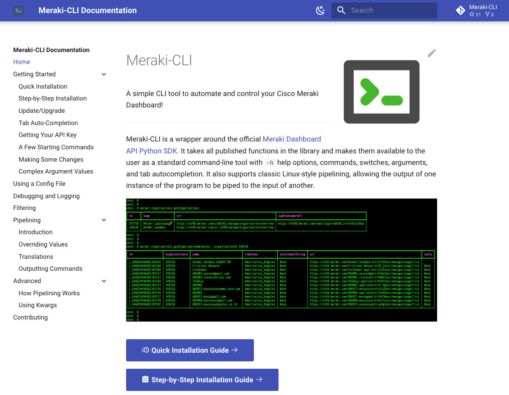

# Meraki-CLI 

A simple CLI tool to automate and control your Cisco Meraki Dashboard!

Quick Install: `pip3 install meraki-cli`

Update/Upgrade Meraki-CLI: `meraki upgrade --upgrade-all`

Try Meraki-CLI: [Try It Out](https://meraki-cli.readthedocs.io/en/latest/try-it-out/)

**Full Documentation**: **[Install Meraki-CLI](https://meraki-cli.readthedocs.io/en/latest/)**

Quick Command Cheat Sheet: [Meraki-CLI Cheat Sheet](CHEATSHEET.md)

Full Command Guide: [Meraki-CLI Command Guide](COMMAND_GUIDE.md)

---

## Documentation

Visit the **[Meraki-CLI Documentation](https://meraki-cli.readthedocs.io/en/latest/)** for installation and usage insructions.

---

## Version
The version of Meraki-CLI documented here is: **1.5.1**

Version History: [Change Log](CHANGELOG.md)

---

## Contributing

This project is very new and has been created out of need. If you have a feature you would like to see built into it, please open up an issue in Github and describe your desired feature. Any accepted feature requests will be listed in the [Enhancement Requests and Known Bugs](https://github.com/PackeTsar/meraki-cli/issues/2) issue page.

If you find a need for a feature and you add it in yourself, or you fix a bug you found, please feel free to open up a merge request!

If neither of those options work for you, and you just want to support this project, you can buy me a coffee :grin:

