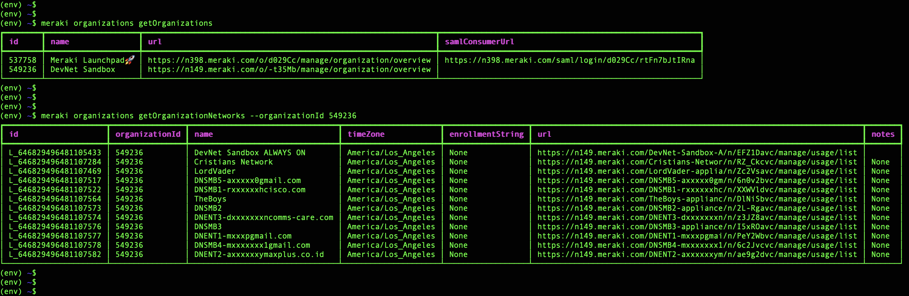

# Meraki-CLI 


[](https://travis-ci.com/PackeTsar/meraki-cli)
[](https://codecov.io/gh/PackeTsar/meraki-cli)
[](https://pypi.python.org/pypi/meraki-cli)
[](https://pypi.python.org/pypi/meraki-cli)
[](https://developer.cisco.com/codeexchange/github/repo/PackeTsar/meraki-cli)

A simple CLI tool to automate and control your Cisco Meraki Dashboard!

Quick Install: `pip3 install meraki-cli`

Command List: **[Meraki-CLI Command Guide](COMMAND_GUIDE.md)**


-----------------------------------------
## VERSION
The version of Meraki-CLI documented here is: **1.2.0**

Version History: **[Change Log](CHANGELOG.md)**


-----------------------------------------
## ABOUT
Meraki-CLI is a wrapper around the official [Meraki Dashboard API Python SDK](https://github.com/meraki/dashboard-api-python). It takes all published functions in the library and makes them available to the user as a standard command-line tool with `-h` help options, commands, switches, and arguments. It also supports classic Linux-style pipelining, allowing the output of one instance of the program to be piped to the input of another.

### Examples

- List your associated organizations: `meraki organizations getOrganizations`
- List the Meraki networks within an organization: `meraki organizations getOrganizationNetworks --organizationId 123456`
- List the MX VLANs on a network: `meraki appliance getNetworkApplianceVlans --networkId N_12345`
- Add a new MX VLAN to a network: `meraki appliance createNetworkApplianceVlan --networkId N_12345 --id 100 --name "My New VLAN" --applianceIp "10.0.0.1" --subnet "10.0.0.0/24"`

### Capabilities

Since the Meraki-CLI tool builds its arguments directly off of Meraki's SDK, it's capabilities exactly match those of the SDK and are updated automatically when Meraki adds new API capabilities. For a list of available commands from the last build of the Meraki-CLI, check out the **[Meraki-CLI Command Guide](COMMAND_GUIDE.md)**.

### Screenshot
[](screenshot.png)

-----------------------------------------
## TABLE OF CONTENTS
1. [Getting Started](#getting-started)
    - [Prepare your OS](#prepare-your-os)
    - [Install Meraki-CLI](#install-meraki-cli)
        - [Upgrading](#upgrading)
    - [Getting and Using your API Key](#getting-and-using-your-api-key)
    - [A Few Starting Commands](#a-few-starting-commands)
    - [Making Some Changes](#making-some-changes)
2. [Using a Config File](#using-a-config-file)
3. [Debugging and Logging](#debugging-and-logging)
4. [Filtering](#filtering)
5. [Pipelining](#pipelining)
    - [Overriding Values](#overriding-values)
    - [Translations](#translations)
    - [Outputting Commands](#outputting-commands)
    - [How the Pipelining Works](#how-the-pipelining-works)
6. [Advanced Usage](#advanced-usage)
    - [Using --kwargs](#using---kwargs)
        - [Dealing with --kwargs on Windows](#dealing-with---kwargs-on-windows)
7. [Contributing](#contributing)


-----------------------------------------
## GETTING STARTED

## Prepare your OS

In order to use Meraki-CLI, you need to have Python 3 installed on your OS. If you do not yet have Python 3 installed, visit this [Python 3 Installation Instructions Page](https://github.com/PackeTsar/Install-Python) and install for your operating system.


## Install Meraki-CLI

The easiest (and recommended) way to install Meraki-CLI is to use PIP.

You can use PIP to install Meraki-CLI with the command `pip3 install meraki-cli` or `python3 -m pip install meraki-cli`

To see if Meraki-CLI was successfully installed, run the `meraki` command and see if it displays the help menu.

#### Upgrading

If you already have Meraki-CLi installed and want to upgrade to the latest release, use the command `pip3 install --upgrade --no-cache-dir meraki-cli` or `python3 -m pip install --upgrade --no-cache-dir meraki-cli`.


## Getting and Using your API Key

Meraki-CLI is command-line driven and once installed can be run with the command `meraki`. Once you have installed it, you can see the command guide by running the `meraki` command by itself.

In order to operate the CLI you need to input your Meraki API key using one of three methods:

1. Saving your API key as an environment variable (recommended):
    - **Windows**: `set MERAKI_DASHBOARD_API_KEY=093b24e85df15a3e66f1fc359f4c48493eaa1b73`
    - **MacOS/Linux**: `export MERAKI_DASHBOARD_API_KEY=093b24e85df15a3e66f1fc359f4c48493eaa1b73`
    - Once saved as an environment variable, you don't need to use the `-k` option when running commands
2. Save your API key to a config file. See the "[Using a Config File](#using-a-config-file)" section for more info on how to do this.
3. Use the `-k <api_key>` or `--apiKey <api_key>` argument at the top level of the command like `meraki -k <api_key>`

You can obtain a Meraki API key by:
- Logging into the Meraki Dashboard
- Clicking your user name in the top right corner
- Browsing to **My profile**
- View the 'API Access' section near the bottom of the page
- Click on the '**Generate new API key**' button and copy down your new API key before saving. It will be a long hexadecimal string.

> Note: The API key seen in the examples above is a public one Meraki provides for testing against their sandbox networks. Feel free to use it for testing things out, but sometimes it gets overused and is throttled by Meraki. All the output examples shown below use that key.


## A Few Starting Commands

Once you have your new key saved, try listing out your organizations with the command `meraki -k API_KEY_HERE organizations getOrganizations`, substituting in your API key. This will print out a formatted table of your organizations. If you saved your API key as an environment variable, you can exclude the `-k` argument and simply issue `meraki organizations getOrganizations`.

Take one of your organization ID numbers and look at the networks in it with `meraki organizations getOrganizationNetworks --organizationId 123456`

You can reformat any of this data into JSON output by adding the `-j` switch (before the command) to look something like `meraki -j organizations getOrganizations`

> It is important to note that the columns included in a table often do not include all of the data returned from the API. If you need to see all the data returned, then use the `-j` switch and allow the tool to print out JSON data.

You can also change the table data which is output by filtering and ordering table columns. To do this, use the `-c` argument and provide a comma-seperated list of columns to display. Example: `meraki -c id,name,description`

To see any help menu, use the `-h` option at any command level:
- `meraki -h` or just `meraki` will show you the top level options and arguments
- `meraki appliance -h` or just `meraki appliance` will show you all the appliance-related commands
- `meraki appliance createNetworkApplianceVlan -h` or just `meraki appliance createNetworkApplianceVlan` will show you an instruction page with all the arguments and options available for creating a new network appliance VLAN.


If you have any Meraki MS switches available, try viewing the port configurations with `meraki switch getDeviceSwitchPorts --serial 1234-ABCD-5678` or you can view the operational port stats by using `meraki switch getDeviceSwitchPortsStatuses --serial 1234-ABCD-5678`


## Making Some Changes

Pushing changes into Meraki is done by running the correct command and passing in the necessary arguments.

For example, if we want to change the VLAN ID and name of a MS switch port, we would use:

`meraki switch updateDeviceSwitchPort --serial 1234-ABCD-5678 --portId 1 --vlan 100 --name "Data Port"`

If the change succeeds, you will often see the newly updated item echoed back like this:

```
~$
~$ meraki switch updateDeviceSwitchPort --serial Q2HP-F5K5-R88R --portId 1 --vlan 100 --name "Data Port"
┏━━━━━━━━┳━━━━━━━━━━━┳━━━━━━━━━┳━━━━━━━━━━━━┳━━━━━━━┳━━━━━━┳━━━━━━━━━━━┳━━━━━━━━━━━━━━┳━━━━━━━━━━━━━━━━━━┳━━━━━━━━━━━━━┳━━━━━━━━━━┳━━━━━━━━━━━━━━━━━┳━━━━━━━━━━━━━━━━┳━━━━━━━━━━━━┓
┃ portId ┃ name      ┃ enabled ┃ poeEnabled ┃ type  ┃ vlan ┃ voiceVlan ┃ allowedVlans ┃ isolationEnabled ┃ rstpEnabled ┃ stpGuard ┃ linkNegotiation ┃ portScheduleId ┃ udld       ┃
┡━━━━━━━━╇━━━━━━━━━━━╇━━━━━━━━━╇━━━━━━━━━━━━╇━━━━━━━╇━━━━━━╇━━━━━━━━━━━╇━━━━━━━━━━━━━━╇━━━━━━━━━━━━━━━━━━╇━━━━━━━━━━━━━╇━━━━━━━━━━╇━━━━━━━━━━━━━━━━━╇━━━━━━━━━━━━━━━━╇━━━━━━━━━━━━┩
│ 1      │ Data Port │ True    │ True       │ trunk │ 100  │ None      │ all          │ False            │ True        │ disabled │ Auto negotiate  │ None           │ Alert only │
└────────┴───────────┴─────────┴────────────┴───────┴──────┴───────────┴──────────────┴──────────────────┴─────────────┴──────────┴─────────────────┴────────────────┴────────────┘
~$
~$
```

Many commands which make changes to the dashboard (like `updateDeviceSwitchPort` above) have optional arguments (like `--vlan` and `--name`) which are used to send those changes. See the below help page for the `updateDeviceSwitchPort` command:

```
~$
~$ meraki switch updateDeviceSwitchPort -h
usage: meraki switch updateDeviceSwitchPort [-h] --serial STRING --portId STRING [--kwargs JSON_STRING]

UPDATE A SWITCH PORT

https://developer.cisco.com/meraki/api-v1/#!update-device-switch-port		

All Arguments:
  --serial (string): (required)
  --portId (string): (required)
  --name (string): The name of the switch port
  --tags (array): The list of tags of the switch port
  --enabled (boolean): The status of the switch port
  --type (string): The type of the switch port ('trunk' or 'access')
  --vlan (integer): The VLAN of the switch port. A null value will clear the value set for trunk ports.
  --voiceVlan (integer): The voice VLAN of the switch port. Only applicable to access ports.
  --allowedVlans (string): The VLANs allowed on the switch port. Only applicable to trunk ports.
  --poeEnabled (boolean): The PoE status of the switch port
  --isolationEnabled (boolean): The isolation status of the switch port
  --rstpEnabled (boolean): The rapid spanning tree protocol status
  --stpGuard (string): The state of the STP guard ('disabled', 'root guard', 'bpdu guard' or 'loop guard')
  --linkNegotiation (string): The link speed for the switch port
  --portScheduleId (string): The ID of the port schedule. A value of null will clear the port schedule.
  --udld (string): The action to take when Unidirectional Link is detected (Alert only, Enforce). Default configuration is Alert only.
  --accessPolicyType (string): The type of the access policy of the switch port. Only applicable to access ports. Can be one of 'Open', 'Custom access policy', 'MAC allow list' or 'Sticky MAC allow list'
  --accessPolicyNumber (integer): The number of a custom access policy to configure on the switch port. Only applicable when 'accessPolicyType' is 'Custom access policy'
  --macAllowList (array): Only devices with MAC addresses specified in this list will have access to this port. Up to 20 MAC addresses can be defined. Only applicable when 'accessPolicyType' is 'MAC allow list'
  --stickyMacAllowList (array): The initial list of MAC addresses for sticky Mac allow list. Only applicable when 'accessPolicyType' is 'Sticky MAC allow list'
  --stickyMacAllowListLimit (integer): The maximum number of MAC addresses for sticky MAC allow list. Only applicable when 'accessPolicyType' is 'Sticky MAC allow list'
  --stormControlEnabled (boolean): The storm control status of the switch port
  --flexibleStackingEnabled (boolean): For supported switches (e.g. MS420/MS425), whether or not the port has flexible stacking enabled.

Function Signature:
	>>> def updateDeviceSwitchPort(serial: str, portId: str, **kwargs):

Required Arguments:
  --serial STRING       (required)
  --portId STRING       (required)

Misc Arguments:
  -h, --help            Show help for this command
  --kwargs JSON_STRING  (Optional arguments in JSON format)
~$
~$
```

For the `updateDeviceSwitchPort` command, you can see from the help page above that there are two required arguments: `--serial` and `--portId`. There are also many optional arguments like `--name`, `--tags`, `--enabled`, `--vlan`, etc. Each of the arguments has its value type listed in the help page.

Simple value types like string, integer, and boolean are pretty straightforward. The can be provided like:
- `--name "Some Descriptive Name"` (string)
- `--vlan 100` (integer)
- `--enabled true` (boolean)

Sometimes it is necessary to provide more complex values in certain arguments. An example from the `updateDeviceSwitchPort` command is the `--tags` argument. The `--tags` argument requires a list (array) of items. You can provide this list of items at the CLI using JSON formatting.

This will look like `--tags '["tag1", "tag2"]'` on a Unix shell or `--tags "[""tag1"", ""tag2""]"` on Windows. This formatting provides a JSON-parsable structure to the CLI tool which is turned into native data and sent over the API to the dashboard. If you want to dive deeper into how to provide JSON data at the CLI, check out the [Using --kwargs](#using---kwargs) and [Dealing with --kwargs on Windows](#dealing-with---kwargs-on-windows) sections.

> Note: Advanced users can use the `--kwargs` option to input all optional parameters as raw JSON data. Check out the [Using --kwargs](#using---kwargs) section for information on how to do that.


## Using a Config File

If you find yourself regularly entering the same arguments into the Meraki-CLI tool like your API key, debug level, logfile, etc, it might make sense to save those settings to a static config file in a permanent location.

The Meraki-CLI tool supports the use of a config file to provide any of its arguments. The config file should contain proper JSON syntax and should be a simple JS object (Python dictionary) in format. An example is shown below. If you want to use the arguments of a currently working command, set a maximum debug level of `-ddd` and copy/paste the JSON output under the "Argument Settings" log statement.

The config file can be obtained by the program by either explicitly defining its location using the `-c` option like `-c ~/meraki-cli.conf`, or by placing the file in a location searched by Meraki-CLI upon program start. The search locations are provided below and are sorted by common OS usage.

- Windows OS
  - `%APPDATA%\meraki-cli\meraki-cli.conf`
    - The `%APPDATA%` is usually equal to `C:\Users\<username>\AppData\Roaming` by default
    - Assuming the default, the config file location would be: `C:\Users\<username>\AppData\Roaming\meraki-cli\meraki-cli.conf`
  - `%LOCALAPPDATA%\meraki-cli\meraki-cli.conf`
    - The `%LOCALAPPDATA%` is usually equal to `C:\Users\<username>\AppData\Local` by default
    - Assuming the default, the config file location would be: `C:\Users\<username>\AppData\Local\meraki-cli\meraki-cli.conf`
- MacOS
  - `~/.meraki-cli/meraki-cli.conf`
    - The `~` directory is your local user directory. It is usually equal to `/Users/<username>/` by default
    - Assuming the default, the config file location would be: `/Users/<username>/.meraki-cli/meraki-cli.conf`
    - Note that the directory name has a leading dot, making it a hidden directory
  - `~/Library/Application Support/meraki-cli/meraki-cli.conf`
    - The `~` directory is your local user directory. It is usually equal to `/Users/<username>/` by default
    - Assuming the default, the config file location would be: `/Users/<username>/Library/Application Support/meraki-cli/meraki-cli.conf`
- Linux
  - `/etc/meraki-cli/meraki-cli.conf`

> Note: Any of the above locations except `/etc/meraki-cli/meraki-cli.conf` will work on any platform. The `APPDATA` and `LOCALAPPDATA` environment variables exist on Windows by default, but can be added to any machine. The two `~` (home) locations will resolve on both Windows or MacOS/Linux to a subdirectory inside the user's home directory.

#### Example `meraki-cli.conf` Config File
```
{
    "apiKey": "093b24e85df15a3e66f1fc359f4c48493eaa1b73",
    "debug": 1,
    "logfile": "meraki.log"
}
```

## Debugging and Logging

If you are having trouble figuring out why something is not working, you can set the debugging level to one of four levels:
- Level 0 (default): Only warnings and errors will be displayed or logged
- Level 1 (`-d`): General status and program progress will be reported
- Level 2 (`-dd`): General program progress as well as Meraki API library debugging will be reported
- Level 3 (`-ddd`): Program progress, Meraki API library debugging, and full data dumps will be reported

If you want to stow those logs away, you can define a log file using something like `-l logs.txt`. Only logs printed to the screen will be written to the file, so you also need to set a debugging level if you want to see anything other than just warnings and errors.


## Filtering

When multiple items are returned from your command, you can filter them by providing a column name (key) and a regular expression to use to match the item's columns value.

For example, you can view only enabled switch ports on a switch with:

`meraki -f "enabled:True" switch getDeviceSwitchPortsStatuses --serial 1234-ABCD-5678`

The filter (`-f`) argument is reusable and you can use it multiple times to match based on more than one column. By default the filter uses "OR" logic when dealing with multiple filters. For example, the below command will show any enabled ports and any ports in VLAN 1000.

`meraki -f "enabled:True" -f "vlan:1000" switch getDeviceSwitchPorts --serial 1234-ABCD-5678`

If you want to combine those filters so displayed items have to match both of them. Pass in the `-a` switch to change the filter logic to "AND" like:

`meraki -f "enabled:True" -f "vlan:1000" -a switch getDeviceSwitchPorts --serial 1234-ABCD-5678`


-----------------------------------------
## Pipelining

Being able to manipulate the Meraki dashboard from the CLI can be quite useful, but its power grows exponentially when you are able to use pipelining. Pipelining allows you to pass the Meraki objects returned in one command into another and do something with them.

> Note: When using pipelining, you will likely want to save your API key as an environment variable since it will need to be available to each instance of the program. Otherwise you would have to insert it multiple times like `meraki -k abcd1234 <commands> | meraki -k abcd1234 <commands>`.

A simple example of this is to display the switch port statuses of the ports on all switches in a network. To do this use:

`meraki networks getNetworkDevices --networkId N_12345 | meraki switch getDeviceSwitchPorts`

The above command can be interpreted the following way:
- The first command (before the pipe) is retrieving and returning all network device objects in a network. Each device object will have a `serial` number attribute with it.
- The pipe between the commands is sending the output of the first command into the input of the second.
- The second command is taking each object in its input and retrieving that object's switch ports. Since the only argument required by the `getDeviceSwitchPorts` command is `--serial`, and the `serial` attribute is contained in each object coming from the first command, the second is able to use that information to loop through the input objects and execute the command on them.
- This functionality should be recognizable to anybody familiar with common pipelining in Linux or PowerShell.

If you, for example, wanted to filter the output of the first command to only output MS250 model switches, you can use a filter in it like:

`meraki -f 'model:MS250' networks getNetworkDevices --networkId N_12345 | meraki switch getDeviceSwitchPorts`


### Overriding Values

Sometimes you want to use the output of one command to feed another, but you want to change something in the data before submitting it in that second command. You can do this by simply providing the changed argument in the command line of the second argument. For example:

`meraki appliance getNetworkApplianceVlans --networkId N_11111 | meraki appliance createNetworkApplianceVlan --networkId N_22222`

Here you are taking all of the configured appliance VLANs in network N_11111 and are pushing them into the `createNetworkApplianceVlan` to create new appliance VLANs. But first you are overriding the `--networkId` attribute of those VLAN objects so they are applied to a different network. You are effectively copying all appliance VLANs from one network to another.


### Translations

At times the attribute names of objects output from one command do not exactly match the required input names of another, even though the actual data is the same. For example: the output of the `getNetworkApplianceVlans` command assigns VLAN ID numbers to the attribute name `id`, however the `deleteNetworkApplianceVlan` command requires the argument name `vlanId`. To deal with this we have to provide a translation using the `-t` argument. If you wanted to delete all the appliance VLANs configured on a network **NOT ADVISABLE**, you would need to provide a translation on the second instance like:

`meraki appliance getNetworkApplianceVlans --networkId N_12345 | meraki -t "vlanId=id" appliance deleteNetworkApplianceVlan`

The `-t "vlanId=id"` argument is effectively telling the receiving program to use the `id` attributes of its input to fill the `vlanId` argument required by the `deleteNetworkApplianceVlan` command.


### Outputting Commands

If you want to test out the power of pipelining, but don't necessarily want to have the commands executed automatically (in case you did something wrong), you can use the `-o` switch to output templatized commands instead. Using the `-o` switch in the receiving command will prevent actual execution, and instead will structure and display commands which will perform that execution; complete with arguments and values. The above command can be safely tested using the below:

`meraki appliance getNetworkApplianceVlans --networkId N_12345 | meraki -o -t "vlanId=id" appliance deleteNetworkApplianceVlan`


### How the Pipelining Works

The pipelining feature of the Meraki-CLI utility works by writing standard JSON data out to STDIN; the same data you see if you use the `-j` switch. All log messages are written to STDERR to prevent interference.

When the program starts, it checks for a leading pipe (ie: `| meraki ...`): the existence of which would indicate that it needs to process STDIN data, which it then does.

When the program processes results to be printed to the screen, it checks for a trailing pipe (ie: `meraki ... |`): the existence of which would indicate that its output will feed another program instance. When this is detected it automatically switches to JSON output and writes it to STDOUT.


## ADVANCED USAGE


### Using --kwargs

Some Meraki-CLI commands require arguments to be provided which are not explicitly defined in the underlying function, but are documented in the command help page. An example of this is the `updateDeviceSwitchPort` command. You can see an example of this command's help page in the [Making Some Changes](#making-some-changes) section.

In the command help page you will see many argument options under the "All Arguments" section, but only two of them are listed in the "Required Arguments" section: `serial` and `portId`. Some of the other arguments in the documentation are things like `name`, `tags`, `enabled`, etc.

When arguments are not listed in the "Required Arguments" or "Misc Arguments" sections of the command help page, they are considered to be Optional Arguments.

Optional Arguments can be provided in one of two ways:
1. Using regular CLI arguments like `--name "Test Name"` and `--vlan 100`
2. Nested as JSON data inside the `--kwargs` argument like `--kwargs '{"name": "Test Name", "vlan": "100"}'`
   - On Windows CLI, you have to use double-double quotes inside the data like `--kwargs "{""name"": ""Test Name"", ""vlan"": ""100""}"`

When Optional Arguments are provided at the command-line (in either of the two ways), they are parsed into native data types and are included as `**kwargs` to the underlying target method when it is called.

Some arguments cannot be simple data types, for example the `--tags` argument from the `updateDeviceSwitchPort` command. The `--tags` argument must be an array, not a simple string or integer. Again there are two ways you can provide this value:
1. Use the `--tags` option and provide a JSON-parsable array like: `--tags '["first_tag", "second_tag"]'`
2. Use the `--kwargs` option to provide the nested JSON data like `--kwargs '{"tags": ["first_tag", "second_tag"]}'`

Both of these options will result in the same data being sent to the underlying target method.


#### Dealing with --kwargs on Windows

The `--kwargs` data passed into Meraki-CLI is a JSON string and the JSON standard requires double-quotes in the data for quoting, it does not allow single-quotes. This becomes challenging on a standard Windows command prompt because Windows usually wants double-quotes used to encapsulate a string on the CLI.. So how do you use double quotes in the data and to encapsulate it?

To do this, use regular double-quotes in front of and behind the string to encapsulate it, and you use double-double-quotes in the actual data. That means replacing all uses of a double-quote characters in the data with two double-quotes. Your argument ends up looking like this: `--kwargs "{""name"": ""Data Port"", ""vlan"": ""100""}"`. It is probably easiest to use find/replace in a text editor to do this for you.

You can also structure the JSON data and your command a bit if you want to make your command more readable. In Windows, you can do this by ending each line with a carat (`^`) which will allow the command to continue on the next line. Your command in this example will look like:

```
meraki switch updateDeviceSwitchPort --serial 1234-ABCD-5678 --portId 24 --kwargs ^
"{ ^
    ""name"": ""Data Port"", ^
    ""vlan"": ""100"", ^
}"
```

-----------------------------------------
## CONTRIBUTING

This project is very new and has been created out of need. If you have a feature you would like to see built into it, please open up an issue in Github and describe your desired feature. Any accepted feature requests will be listed in the [Enhancement Requests and Known Bugs](https://github.com/PackeTsar/meraki-cli/issues/2) issue page.

If you find a need for a feature and you add it in yourself, or you fix a bug you found, please feel free to open up a merge request!
