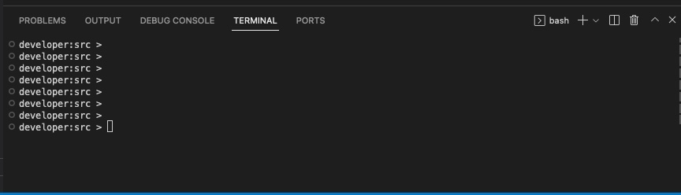

[](https://developer.cisco.com/codeexchange/github/repo/PackeTsar/meraki-cli){:target="_blank"}

---

You can kick the tires on Meraki-CLI using **Cisco's DevNet Cloud IDE**

:three_oclock: Estimated Time Required: **3 minutes**

---

## Step 1: Open a Code Space

- Go to [Meraki-CLI's Cisco Code Exchange page](https://developer.cisco.com/codeexchange/github/repo/PackeTsar/meraki-cli){:target="_blank"}
- Click on the "**Run in Cloud IDE**" button
    - You will need to log in to Cisco during this process
- Once the Code Space is opened, you will see a CLI terminal at the bottom of the page which looks like the below
    - If you don't see a terminal at the bottom, click the hamburger menu icon on the left pane, and click **Terminal** > **New Terminal**




## Step 2: Install Meraki-CLI

- In this terminal, run the command to install Meraki-CLI:
```bash
pip3 install meraki-cli
```
- Once the installation is finished, enable tab auto-completion with:
```bash
eval "$(register-python-argcomplete meraki)"
```
- Now you should be able to type in `meraki`, hit the TAB key twice, and see a list of commands
``` { .bash .no-copy }
developer:src >
developer:src > 
developer:src > meraki 
-a                 batch              --configFile       --filter           --jsonOutput       networks           sensor             upgrade            
administered       -c                 -d                 -h                 -k                 -o                 sm                 -v                 
--and_logic        camera             --debug            --help             -l                 organizations      switch             --version          
--apiKey           cellularGateway    devices            insight            licensing          --output_commands  -t                 wireless           
appliance          --columns          -f                 -j                 --logfile          -s                 --translation      
developer:src > meraki 
```
- If you hit ENTER with just `meraki` typed in the prompt, it will output the help page

??? info "Help Page"

    ````
    developer:src >
    developer:src >
    developer:src > meraki 
    usage: meraki [-h] [-v] [-k STRING] [-d] [-l PATH] [-c PATH] [-j] [-s STRING] [-f STRING] [-a] [-t STRING] [-o]
                {upgrade,administered,appliance,batch,camera,cellularGateway,devices,insight,licensing,networks,organizations,sensor,sm,switch,wireless} ...

    Basic Arguments:
    -h, --help            Show help at any command level
    -v, --version         show program's version number and exit
    -k STRING, --apiKey STRING
                            Meraki API Access Key
    -d, --debug           Set debug level 1-3 (ie: -d or -dd)
    -l PATH, --logfile PATH
                            Write logs to a logfile
    -c PATH, --configFile PATH
                            Use a config file for some arguments

    Output Formatting:
    -j, --jsonOutput      Format output as JSON insted of default
    -s STRING, --columns STRING
                            Filter/Order Table Columns (ie: id,networkId,etc)

    Filtering:
    -f STRING, --filter STRING
                            Search filter for returned items (ie: "name:Headquarters")
    -a, --and_logic       Use "AND" logic for multiple filters instead of default "OR"

    Pipelining:
    -t STRING, --translation STRING
                            Key translation for piped input (ie: "id=vlanId")
    -o, --output_commands
                            Output formatted commands instead of executing actions.

    Command Types:
    {upgrade,administered,appliance,batch,camera,cellularGateway,devices,insight,licensing,networks,organizations,sensor,sm,switch,wireless}
        upgrade             Upgrade Meraki-CLI components (no Dashboard interaction)
        administered        administered commands
        appliance           appliance commands
        batch               batch commands
        camera              camera commands
        cellularGateway     cellularGateway commands
        devices             devices commands
        insight             insight commands
        licensing           licensing commands
        networks            networks commands
        organizations       organizations commands
        sensor              sensor commands
        sm                  sm commands
        switch              switch commands
        wireless            wireless commands
    developer:src >
    developer:src >
    developer:src >
    ````

## Step 3: Get your Meraki API Key

To allow Meraki-CLI to access your Meraki Dashboard, you will need to enter a Meraki API key into the prompt as an environment variable.

- Use the below test key or follow the instructions on the [Getting Your API Key](../getting-your-api-key/) page to set your API key

```bash
export MERAKI_DASHBOARD_API_KEY=6bec40cf957de430a6f1f2baa056b99a4fac9ea0
```

- Once you have entered your API key, you will be able to start running Meraki-CLI commands against your Meraki Dashboard!

!!! example "Try It Out!"

    ```
    meraki organizations getOrganizations
    ```

---

[Next: A Few Starting Commands :octicons-arrow-right-24:](../a-few-starting-commands/){ .md-button .md-button--primary }
